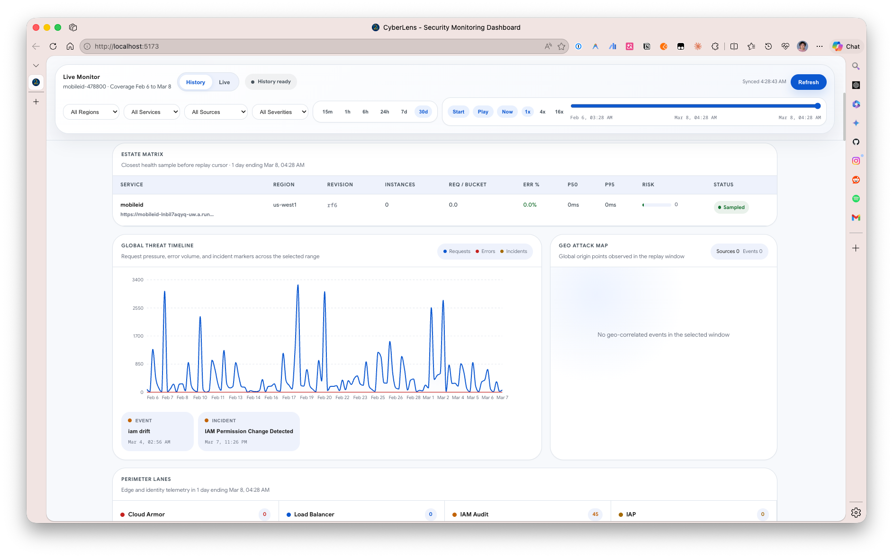
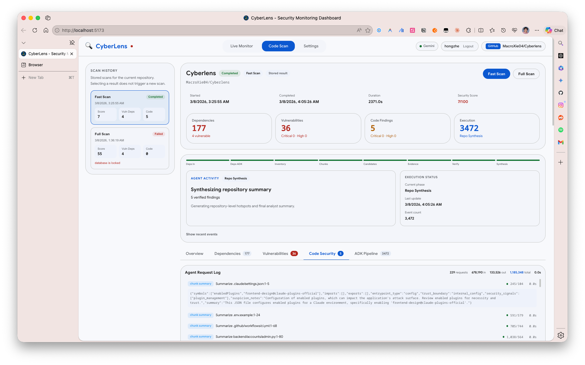
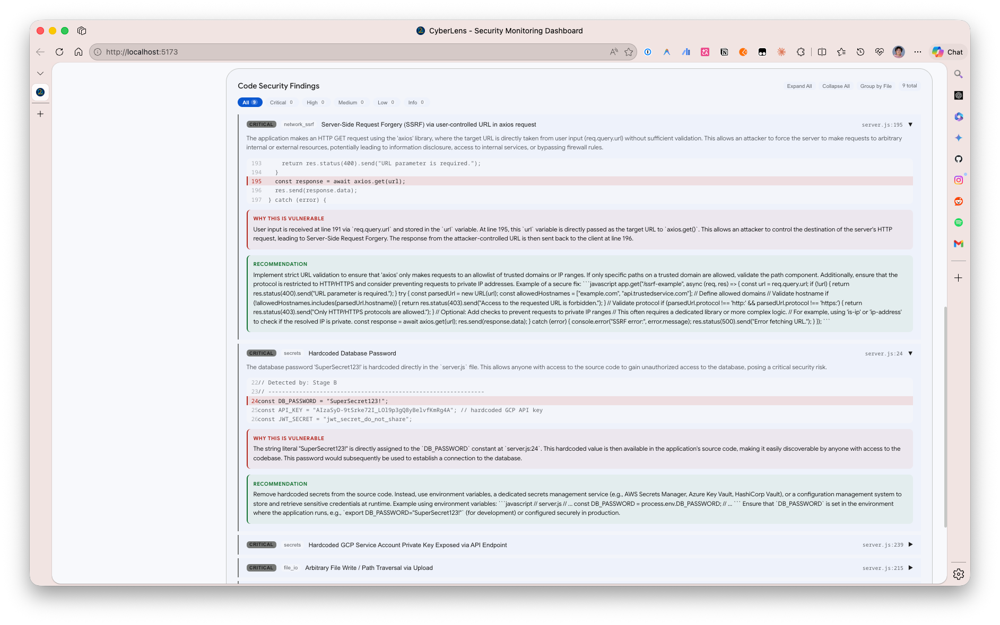
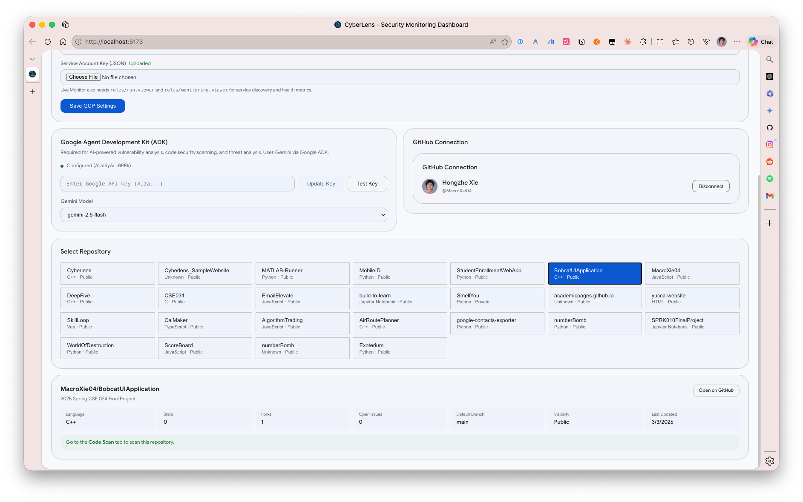

# CyberLens

AI-powered security monitoring and vulnerability scanning dashboard.

CyberLens combines:

- a Django API for auth, monitoring, scanning, and settings
- a React dashboard for the SOC and supply-chain views
- a Node realtime bridge that streams Redis events to the browser

## Screenshots

### Live Monitor



### Code Scan



### Code Security Findings



### Settings



## Quick Start

```bash
# 1. Configure environment
cp .env.example .env

# 2. Backend
cd backend
python -m venv .venv && source .venv/bin/activate
pip install -r requirements.txt
python manage.py migrate
python manage.py createsuperuser
python manage.py runserver 0.0.0.0:8000

# 3. Celery worker
cd backend && celery -A cyberlens worker -l INFO

# 4. Frontend
cd frontend && npm install && npm run dev

# 5. Realtime bridge
cd realtime && npm install && npm run dev
```

Services:

- Frontend: `http://localhost:5173`
- Backend API: `http://localhost:8000`
- Realtime: `http://localhost:3001`

Redis must be available on `localhost:6379`.

## Project Layout

```text
.
├── backend/   Django API, Celery tasks, monitor/scanner/accounts apps
├── frontend/  React + TypeScript dashboard
├── realtime/  Socket.IO <-> Redis bridge
└── docs/      Architecture, setup, API, and pitch notes
```

## Docs

- [Architecture](docs/architecture.md)
- [Setup](docs/setup.md)
- [API Reference](docs/api.md)
- [Pitch Story](docs/pitch/story.md)
- [Pitch Demo](docs/pitch/demo.md)

## Testing

```bash
python tools/check_handwritten_line_counts.py
cd backend && pytest
cd frontend && npm test && npx tsc -b
cd realtime && npm run build
```
